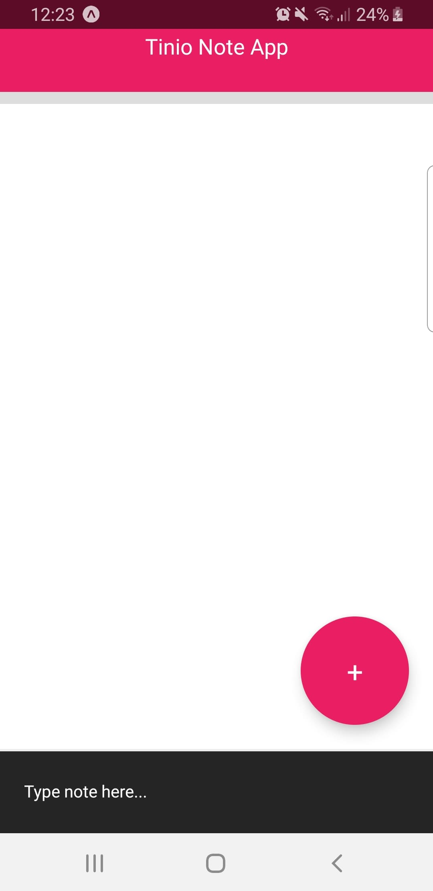
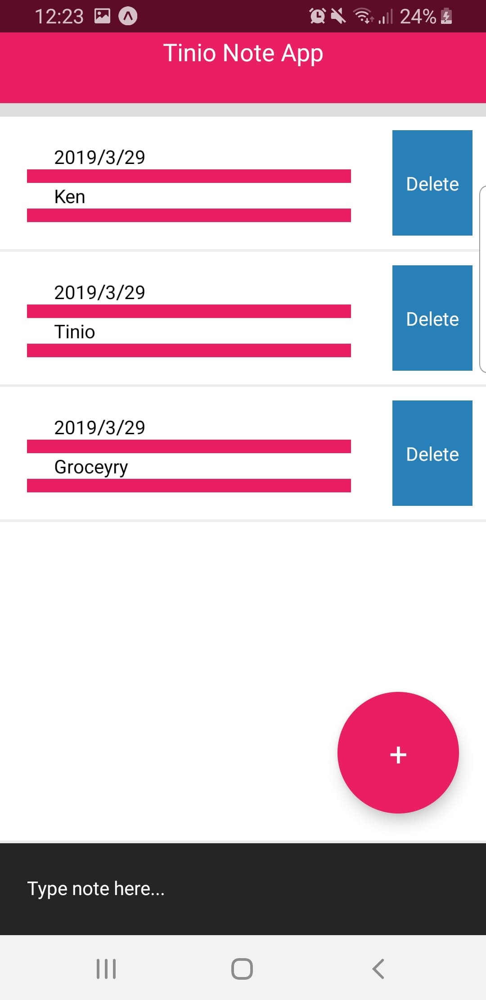

# React Native - Note Application (CRUD)  
Development time version 0.59  

## UI  
### View 1 - Empty 
  

### View 2 - Populated
 

By Following this Tutorial 
[How to make an app - React Native Tutorial - Create a Todo App in 25 minutes](https://www.youtube.com/watch?v=xb8uTN3qiUI&t=44s)  
